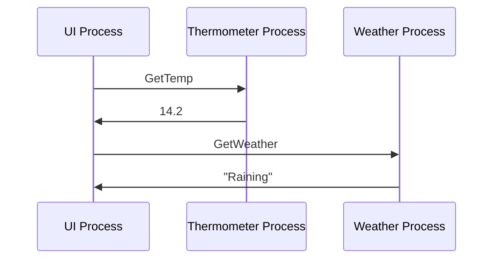

# Building a Type Safe OTP

twitter: @louispilfold

<!--
Hello!
-->

---
layout: two-cols
---

# Hi, I'm Louis!

- 🐙 I love Erlang
- ⚗️ I love Elixir
- 🔮 I love types
- ✨ I made Gleam


twitter: @louispilfold <br>
github: @lpil

::right::


<!--
Who am I

I love Erlang, Elixir, BEAM, the experience

I love types, ML languages, the experience

I made Gleam
-->

---
---
# This is a talk about OTP & types

- ❌ Sales pitch
- ❌ Introduction to types
- ✅ Exploring OTP internals
- ✅ Solving a technical problem

<style>
  h1 {
    text-align: center;
  }
  ul {
    display: block;
    margin: 0 auto !important;
    width: 80%;
  }
  li {
    font-size: 1.3rem;
  }
</style>

<!--
People like to debate types: I'm not doing that

Not an introduction

Assuming existing interest + understanding of basics

Explore OTP, share what Gleamers have been working on
-->

---
layout: quote
class: text-center
---

# "It is not possible to type OTP"
<i>- seemingly everyone in 2015</i>

<h3 v-click>
  ✨ OK, let's type all the other bits ✨
</h3>
<br>
<br>
<br>
<br>
<br>

<!--
I wanted to add types to Erlang

People would say not possible

Disappointing

But most Erlang code isn't OTP

**CLICK**

We know FP can be typed

Let's type that
-->
---
layout: image-right
image: /daniele-franchi-S4jPaP071KI-unsplash.jpg
---


A friendly programming language

- Runs on the BEAM
- Has a strong static type system

<!--
Resulted in Gleam

BEAM: actors, distributed, multi-core, fault tolerant

Types: like Elm. Compiler trying to help

A new way to write code on the BEAM
-->
---

# A brief history of Gleam

- 2018: Development begins
- 2019: v0.1 released
- 2020: Language refinement, formatter, html docs, OTP
- 2021: Build tool, new parser, JavaScript, typespecs
- 2022: LSP, JSON, WASM, .d.ts

<style>
  li {
    margin-top: 0.6rem;
  }
</style>

<!--
Gleam history

Notice OTP in 2020

original assumption was wrong

maybe we can make a type safe OTP

useful, enjoyable, compatible
-->
---
class: text-center
---

# What do you mean by type safe?

<!--
Pit of success

The most obvious solution should be optimal

Invalid solutions should not be possible

Compiler helps you

That's the goal
-->

---
---
# Records

```rust
pub type Language {
  Language(name: String, origin: Int)
}
```

<br>

```erlang
-module(my_erlang_module).
-export_type([language/0]).

-record(language, {name :: binary(), origin :: integer()}).
-type language() :: #language{}.
```

<!--
Quick intro to Gleam

Gleam top, Erlang bottom

Declaring a record
-->
---
---
# Functions

```rust {all|2|3|all}
pub fn add_gleam(languages) {
  let gleam = Language(name: "Gleam")
  [gleam, ..languages]
}
```
<br>

```erlang
-module(my_erlang_module).
-export([add_gleam/1]).

-spec add_gleam(list(#language{})) -> list(#language{})
add_gleam(Languages) ->
    Gleam = #language{ name = <<"Gleam">>} 
    [Gleam | languages]
```

<!--
Declare a function

**CLICK** Constructs a language record

**CLICK** Prepend it to a list

**CLICK** No annotations needed!
-->

---
---
# Mistake detection

```rust {2}
pub fn add_gleam(languages) {
  let gleam = Language(name: "Gleam")
  [gleam, ..languages]
}
```
<br>

```
  ┌─ ./src/main.gleam:9:5
  │
9 │     let gleam = Language(name: "Gleam"),
  │                 ^^^^^^^^^^^^^^^^^^^^^^^ expected 2 arguments, got 1

This call accepts these additional labelled arguments:
  - origin
```

<!--
Gleam will tell you about mistakes

We said Language has 2 fields

We only gave 1

Helping to catch mistakes
-->
---
layout: center
class: text-center
---

# No send or receive in Gleam!
We gotta import them

<!-- 
No send/receive

To work with processes you must use Erlang FFI
-->

---
---

# External types

```erlang {all|5}
-module(my_erlang_module).
-export_type([my_type/0]).

% Define a type in Erlang
@opaque my_type() :: term().
```
<br>

```rust {all|2}
// Import it into Gleam
external type MyType
```

<!--
Permits referencing Erlang types in Gleam

**CLICK** Define in Erlang

**CLICK** Import in Gleam
-->
---
---

# External functions

```erlang {all|4-6}
-module(my_erlang_module).
-export([add/2]).

-spec add(float(), float()) -> float().
add(A, B) ->
    A + B.
```
<br>

```rust {all|1-2}
external fn add(Float, Float) -> Float =
  "my_erlang_module" "add"

pub fn main() {
  add(1.0, 2.2) // <- Use it!
}
```

<!--
Permits calling Erlang functions in Gleam

**CLICK** Define in Erlang

**CLICK** Import in Gleam

That's enough. Let's make type safe OTP!
-->
---
---
# Let's wrap gen_server

<div grid="~ cols-2 gap-4">
<div>

```erlang
init(_Args) ->
    {ok, 0}.


handle_call(increment, _From, X) ->
    {reply, X, X + 1};
handle_call(is_zero, _From, X) ->
    {reply, X, X =:= 0}.


handle_cast(reset, _) ->
    {noreply, 0}.
```

</div>
<div>

```rust
pub fn init(_args) {
  Ok(0)
}

pub fn handle_call(msg, _from, x) {
  case msg {
    Increment -> Reply(x, x + 1)
    IsZero -> Reply(x, x == 0)
  }
}

pub fn handle_cast(msg, _x) {
  case msg {
    Reset -> Noreply(0)
  }
}
```

</div>
</div>

<!--
One to one wrapping

Gleam checks consistency within functions

Similar to what Elixir does

Is this good enough?
-->
---
---
# Consistently wrong

<div grid="~ cols-2 gap-4">
<div>

```erlang
init(_Args) ->
    {ok, 0}.


handle_call(increment, _From, X) ->
    {reply, X, X + 1};
handle_call(is_zero, _From, X) ->
    {reply, X, X =:= 0}.


handle_cast(reset, _) ->
    {noreply, 0}.
```

</div>
<div>

```rust
// pub fn init(_args) {
//   Ok(0)
// }

pub fn handle_call(msg, _from, x) {
  case msg {
    Increment -> Reply(x, x + 1)
    IsZero -> Reply(x, x == 0)
  }
}

pub fn handle_cast(msg, _x) {
  case msg {
    Reset -> Noreply(0)
  }
}
```

</div>
</div>

<!--
What if we forgot a function?

This is consistent

wrong for gen_server

Gleam doesn't know about Erlang behaviours

We could add a module system (complexity)

Is that enough?
-->

---
---
# Internally inconsistent

<div grid="~ cols-2 gap-4">
<div>

```erlang {0}
init(_Args) ->
    {ok, 0}.


handle_call(increment, _From, X) ->
    {reply, X, X + 1};
handle_call(is_zero, _From, X) ->
    {reply, X, X =:= 0}.


handle_cast(reset, _) ->
    {noreply, 0}.
```

</div>
<div>

```rust {7-8}
pub fn init(_args) {
  Ok(0)
}

pub fn handle_call(msg, _from, x) {
  case msg {
    Increment -> Reply(x, x + 1)
    IsZero -> Reply(x, x == 0)
  }
}

pub fn handle_cast(msg, _x) {
  case msg {
    Reset -> Noreply(0)
  }
}
```

</div>
</div>

<!--
Look closer

- Increment returns reply of int
- IsZero returns reply of bool

Violates the contract- functions return a specific type

Elixir solves with set-theoretic types

But! no relationship between message & response!

Could reply with bool to Increment. consistent but wrong
-->

---
layout: center
class: text-center
---
# New constraints: new API

<!--
gen_server is ideal for Erlang

It was designed for Erlang

We need an API designed for types

Compatible, equivalent, but different

Make full use of Gleam.
-->
---
layout: center
class: text-center
---
# OTP is implemented in Erlang

Gleam should be as powerful

<!--
OTP is Erlang

Gleam's OTP should be in Gleam

If we can't then our abstraction isn't powerful enough

Right primitives -> we can implement OTP
-->
---
layout: image-left
image: /jake-weirick-dWUPJdXiC-M-unsplash.jpg
---
# The primitives

- spawn
- monitor
- send
- receive
- link
- trap_exits

<!--
These are the concurrency primitives

used to implement OTP in Erlang

If we have this power in Gleam we can do the same

Erlang imports these from C

Gleam will import them from Erlang
-->
---

## Spawn

```rust {all|1|3-4}
pub external type Pid

pub external fn spawn(fn() -> a) -> Pid
  "erlang" "spawn"

pub external fn spawn_link(fn() -> a) -> Pid
  "erlang" "spawn_link"
```
<br>

```rust
let pid = spawn(fn() {
  // Do stuff!
})
```

<!--
Start with an easy one: Spawn

**CLICK** Import the Pid type from Erlang

**CLICK** Import the spawn functions

1 to 1 mapping. No changes
-->

---
---
## Link

```rust
pub external fn link(Pid) -> Bool =
  "erlang" "link"
```

<!--
Link

Really easy, just import the function from Erlang
-->

---
---
## Trap exits

```rust
pub external fn trap_exits(Bool) -> Nil =
  "gleam_otp_erl" "trap_exits"
```
<br>

```erlang
% Erlang wrapper to simplify API
trap_exits(Bool) ->
    erlang:process_flag(trap_exit, Bool),
    nil.
```

<!--
Next: Trap exits

Diverged from Erlang API slightly

We could import all the `process_flag` functionality

but here we keep it simple

small Erlang wrapper

Making a dedicated `trap_exits` function
-->


---
---
## Monitor

```rust {all|6|0}
pub external type Monitor

pub external fn monitor(Pid) -> Monitor =
  "gleam_otp_erl" "monitor_process"

pub external fn demonitor(Monitor) -> Nil =
  "gleam_otp_erl" "demonitor_process"
```
<br>

```erlang {all|4|7}
-opaque monitor() :: reference().

monitor_process(Pid) ->
    erlang:monitor(process, Pid).

demonitor_process(Ref) ->
    erlang:demonitor(Ref, [flush]),
    nil.
```

<!--
Import monitor type, monitor + demonitor functions

Diverged from the Erlang API more

Erlang wrapper functions to make invalid states impossible.

- **CLICKS EACH**
- Can't use a non-monitor reference with unlink
- Can't pass the wrong atom, it is always correct
- Can't forget to flush outdated messages

Small changes, easier to use
-->

---
---
## Send & receive

```rust {all|1|4}
pub external fn send(Pid, msg) -> msg =
  "erlang" "send"

pub external fn receive(Int) -> Option(UnknownType) =
  "gleam_otp_erl" "receive_"
```
<br>

```erlang
receive_(Timeout) ->
    receive
        Msg -> {some, Msg}
    after Timeout -> none
    end.
```

<!--
The last bit! Send & receive

Import send directly, import a wrapper around receive

Problem: pids getting the right messages

**CLICK** send lets you send any message

**CLICK** receive doesn't know kind of message it returns

Type safe OTP => only correct messages get sent
-->

---

## Parameterise Pids

```rust {all|3}
pub external type Pid(msg)

pub external fn send(Pid(msg), msg) -> msg =
  "erlang" "send"
```
<br>

```rust
pub fn main(pid) {
  send(pid, "Hello!") // It must be a Pid(String)
  send(pid, 123)      // Inconsistent! Wrong message type!
}
```

<!--
Solution: parameterise pids with the message they accept

pid accepts strings: Pid(String) type

pid accepts floats: Pid(Float) type

**CLICK** `send` must have a pid and message of the same type
-->

---
---
## What about replies?

<div class="text-center">



</div>

<!--
3 processes in an app

UI sends `GetTemp`: gets Float reply

UI sends `GetWeather`: gets String reply

Problem! The replies have different types!

UI needs to accept Float & String replies

Erlang processes are complex

cannot be limited to one message type

Where to store semantic information if not the Pid?
-->

---
---
## Attaching meaning to messages

A problem OTP already solves ✨

```erlang
% inside OTP's gen.erl module

-opaque from() :: {pid(), reference()}.

-spec reply(from(), Msg) -> Msg.
reply(From, Reply) ->
    {To, Tag} = From,
    To ! {Tag, Reply}.
```

<!--
OTP had a similar problem

Which message is a reply to which?

Need to attach meaning to each message

Solution: `from` type, a message with a tag.

Can selective receive for messages with tag.

It wasn't for types, but the same technique applies
-->

---
---
## Converted to Gleam

```rust {all|1-3|5-8}
pub type From {
  From(pid: Pid, tag: Reference)
}

pub fn reply(from: From, reply: msg) {
  untyped_send(from.pid, #(from.tag, reply))
}

pub external fn untyped_send(Pid, msg) -> msg =
  "erlang" "send"
```

<!--
Here it what it would look like in Gleam

**CLICK** Define a `From` type

**CLICK** define a `reply` fn which send msg with tag

Next: have it store message type information
-->

---
---
## Add message type

```rust
pub type From(msg) {
  From(pid: Pid, tag: Reference)
}

pub fn reply(from: From(msg), reply: msg) {
  untyped_send(from.pid, #(from.tag, reply))
}

pub external fn untyped_send(Pid, msg) -> msg =
  "erlang" "send"
```

<!--
`From` has message type as a parameter

`reply` fn states that `From` and `msg` must have same type
-->

---
---
## Not just for replying

```rust
pub type Subject(msg) {
  Subject(pid: Pid, tag: Reference)
}

pub fn send(subject: Subject(msg), reply: msg) {
  untyped_send(subject.pid, #(subject.tag, reply))
}

pub external fn untyped_send(Pid, msg) -> msg =
  "erlang" "send"
```

<!--
In Erlang: just for replying

In Gleam: for sending too

Rename: `From` to `Subject`

Rename: `reply` to `send`.

`send` replaces the previous `send`
-->

---
---
## Make invalid use impossible

```rust
pub opaque type Subject(msg) {
  Subject(pid: Pid, tag: Reference)
}

pub fn send(subject: Subject(msg), reply: msg) {
  untyped_send(subject.pid, #(subject.tag, reply))
}

external fn untyped_send(Pid, msg) -> msg =
  "erlang" "send"
```

<!--
Make invalid use impossible

Make `Subject` internals private

Make `untyped_send` private

The only public API is one that cannot be misused!

It is not possible to send an incorrect message
-->

---
class: text-center
layout: center
---

# ✨ We have type safe sending ✨

<!--
Sending done!

Other half: receiving
-->

---

## Type safe receiving

```erlang


receive_({subject, _, Tag}, Timeout) ->
    receive
        {Tag, Msg} ->
            {some, Msg}
    after Timeout -> none
    end.
```

<!--
fn receives a message for a subject

- tag from selector
- selective receive for msg with tag
- if no msg, return none

Copied from Erlang OTP reply receive code

Works for 1 subject. We want to wait on many
-->

---

## Receiving for multiple subjects

```erlang {all|1|4-6}
-opaque selector(Msg) :: #{reference() => true}

select(Selector, Timeout) ->
    receive
        {Tag, Msg} when is_map_key(Tag, Selector) ->
            Msg
    after Timeout -> none
    end.


add_subject(Selector, {subject, _, Tag}) ->
    Selector#{Tag => true}

new_selector() -> #{}.
```

<!--
Single -> multiple

**CLICK** New selector type: map of references

**CLICK** Select function selective receives messages with tag in map

Problem: all subjects have same type

We want to receive different types at once
-->

---
---
## Different message types

```erlang {all|1|4-7}
-opaque selector(Msg) :: #{reference() => fun(term()) -> Msg}

select(Selector, Timeout) ->
    receive
        {Tag, Msg} when is_map_key(Tag, Selector) ->
            Transformer = maps:get(Tag, Selector),
            Transformer(Msg)
    after Timeout -> none
    end.

add_subject(Selector, {subject, _, Tag}, Transformer) ->
    Selector#{Tag => Transformer}

new_selector() -> #{}.
```

<!--
Need to normalise all messages into a single type

**CLICK** Selector map holds transformer functions

Transformer: subject msg type -> selector msg type

**CLICK**: message received: apply transformer fn

Bit complex: Let's see it in Gleam
-->

---

## Gleam usage

```rust {all|1,2|3-6|7-10|12-14}
let str_subject = new_subject()
let int_subject = new_subject()

send(str_subject, "Hello")
send(int_subject, 12345)

// Create a Selector(String)
let selector = new_selector()
  |> add_subject(str_subject, function.identity)
  |> add_subject(int_subject, int.to_string)

select(selector, 0) // -> Some("Hello")
select(selector, 0) // -> Some("12345")
select(selector, 0) // -> None
```

<!--
Import as usual

- **CLICK** Create 2 subjects.
- **CLICK** Send a message to each. Different types
- **CLICK** Create a Selector.
  - String subject right type: identity
  - Int subject: int.to_string
- **CLICK** Receive messages
  - 1st: string hello
  - 2nd: 12345 transformed into String
-->

---
layout: center
---
# ✨ All the primitives ✨

<div>

- ✅ spawn
- ✅ monitor
- ✅ send
- ✅ receive
- ✅ link
- ✅ trap_exits

</div>

<!--
That's it

All the primitives used to implement OTP

Other than this untyped Erlang core: everything type safe

Prove it: implement gen_server
-->

---
layout: image-left
image: /ben-maguire-FTYgqLeseI4-unsplash.jpg
---
# gen_server

- Synchronous start
- Handle system messages
- Hold state
- Asynchronous messages
- Synchronous messages

Let's do it in Gleam ✨

<!--
What does gen_server do? These main things

Sync start: parent waits, is child OK? Verify environment correct at boot

System messages: debugging. hidden. under the hood

Hold state: update with each new message

Async, sync messages: passed to the user

NOW: Implement it in Gleam. Call it Actor.
-->


---
---
## Synchronous starting

```rust {all|2-3|5-12}
pub fn start_actor(init, on_message) {
  let done = process.new_subject()
  let child = spawn_link(fn() { init_actor(init, on_message, done) })

  case receive(done, 1000) {
    Some(result) -> result

    None -> {
      kill(child)
      Error(InitTimeout)
    }
  }
}
```

<!--
Start with the start code.

Same primitives: can copy Erlang implementation. `proc_lib`

- fn takes init & handle_msg callbacks
- **CLICK**: Create subject (for child to parent)
- Start child. Runs `init_actor` fn
- **CLICK**: Waits for a message from child
- If message: return result
- If no message: timeout, kill process, return error

What does `init_actor` do? run by child
-->

---
---
## Initialisation

```rust {all|3-7|9-12}
fn init_actor(init, handle_message, parent) {
  case init() {
    Ok(state) -> {
      let subject = new_subject()
      send(parent, Ok(subject))
      loop(Data(state, subject, handle_message))
    }

    Error(reason) -> {
      send(parent, Error(reason))
      exit(Abnormal)
    }
  }
}
```

<!--
More stealing. From `proc_lib` & `gen_server`.

- Call programmer-supplied `init` callback.
- **CLICK**. If OK:
  - create subject to receive messages on
  - send to parent to indicate initialised
  - enter message loop, with initial state.
- **CLICK**. If Error:
  - send error to parent
  - terminate process
-->

---
---
## Message loop

```rust {all|2-3|4|6-10}
fn loop(data) {
  let selector = make_selector(data)
  case select(selector) {
    System(system) -> handle_system_message(data, system)

    Message(msg) ->
      case data.handle_message(msg, data.state) {
        Stop(reason) -> exit(reason)
        Continue(state) -> loop(Data(..data, state: state))
      }
  }
}
```

<!--
Loop fn, runs on actor after init

Different to gen_server here

- **CLICK** make selector for subject + system messages
- receive a message with it
- **CLICK** if system message call handle fn
- **CLICK** if regular message
  - call programmer supplied handler
  - handler returns Stop or Continue
  - if stop, process terminates
  - if continue, loop again with new state
-->

---

## System messages

```rust {all|3-6}
fn handle_system_message(data, system_message) {
  case system_message {
    GetState(send_reply) -> {
      send_reply(self.state)
      loop(self)
    }
    // Other system messages here...
  }
}
```

<!--
When system message => called this function

Handles all "behind the scenes" messages for you

Match on message and do whatever is required

- **CLICK** GetState 
  - send state
  - continue looping
-->

---
---
## Sending synchronous messages

```rust {all|2-4|6-9}
pub fn call(subject, make_message) {
  let reply_to = new_subject()
  let message = make_request(reply_to)
  send(subject, message)

  case receive(reply_to, 1000) {
    Some(reply) -> Ok(reply)
    None -> Error(Timeout)
  }
}
```
<!--
Server side: done! Client side now

Port `gen_server:call` to Gleam, to send sync messages

- **CLICK** New subject to get reply on
- Pass subject into supplied message constructor
  - explain next slide
- Send message to actor
- **CLICK** wait for a response
  - If there is one: return it
  - If not: return timeout error
-->

---
---
## Defining an actor

```rust {all|1-3|5-9|10-18}
pub fn start_counter_actor() {
  start_actor(fn() { 0 }, handle_message)
}

pub type Message {
  Increment
  GetCount(caller: Subject(Int))
}

fn handle_message(message, count) {
  case message {
    GetCount(caller) -> {
      send(caller, count)
      Continue(count)
    }
    Increment -> Continue(count + 1)
  }
}
```

<!--
gen_server equivalent done. Now define an actor using it

- **CLICK** Function to start it.
  - call `start_actor` with `init` + `handle_msg`
- **CLICK** Actor accepts 2 msgs
  - Increment
  - GetCount. Subject as argument, to send a reply
- **CLICK** Define `handle_msg`. Pattern match on msg
  - Increment increments the count
  - GetCount sends a reply msg
-->

---

# Interacting with it

```rust
let counter = start_counter_actor()

// async messages
send(counter, Increment)
send(counter, Increment)
send(counter, Increment)

// sync messages
call(counter, GetCount) // => Ok(3)
```

<!--
Now defined, we can use it

Start with `start_counter_actor`

async messages with normal `send`. Like `gen_server:cast`

sync messages that get a response with `call`. Like `gen_server:call`.

DONE! Implemented & used a type safe gen_server from scratch
-->

---
layout: center
class: text-center
---
# ✨ OTP can be typed! ✨

In Gleam, or any other language

<!--
With right primitives => can build OTP

Implemented gen_server, can do supervisor etc too.

Used 1 technique, not the only way! Pros, cons. Just showing that it is possible.

Used Gleam, but can use any language.

Elixir & Erlang gets types => valuable to type OTP in them.
-->

---
layout: center
class: text-center
---


[gleam.run](https://gleam.run)

[github.com/gleam-lang/erlang](https://github.com/gleam-lang/erlang)

[github.com/gleam-lang/otp](https://github.com/gleam-lang/otp)

<style>
  img {
    display: inline-block;
    margin: 1.0rem 10vh;
    margin-top: 0;
  }
  p {
    margin: 0.2rem !important;
  }
</style>

<!--
Thank you to sponsors, especially Fly + Alembic.

Full implementation: on GitHub. + Gleam website

Any question? Ask them!
-->
